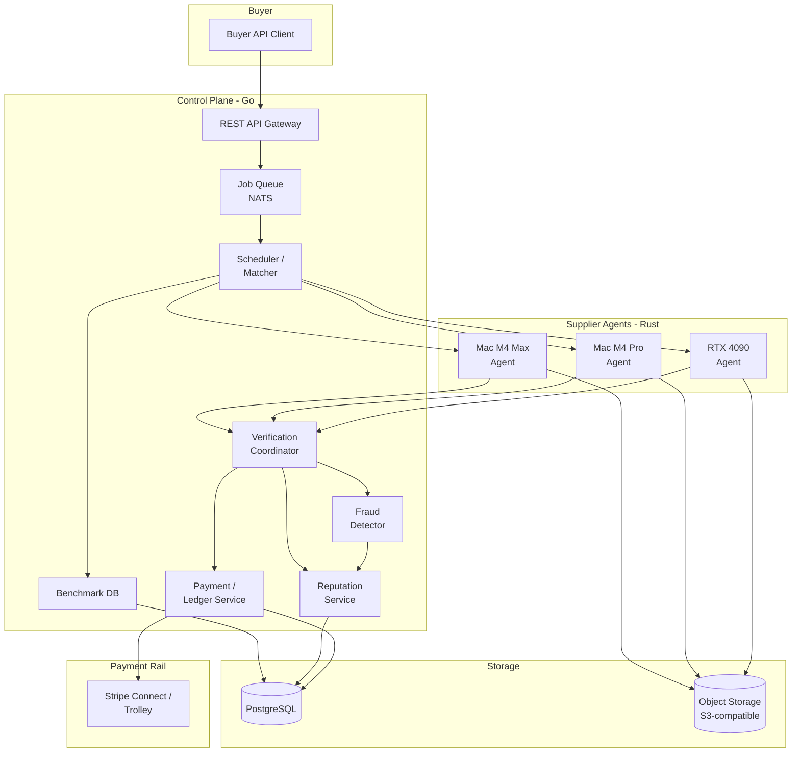
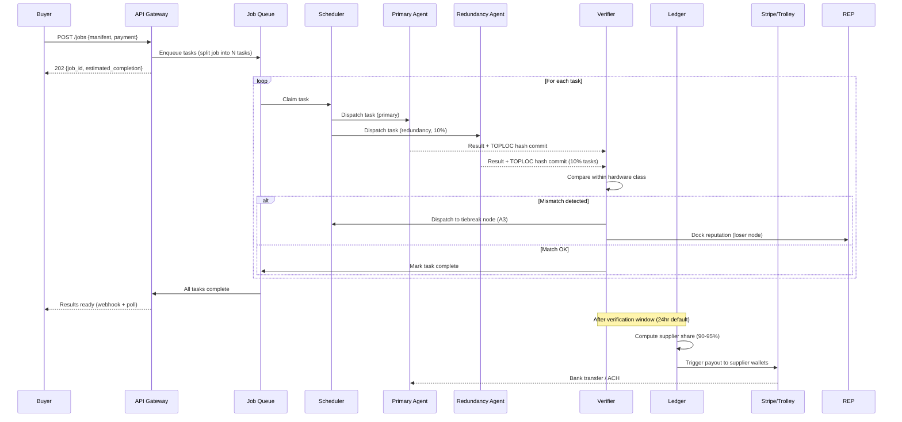

# Computexchange — Hardened Action Plan
*June 2026 · Research-verified, adversarially stress-tested, execution-grade*

> **⚠️ SCOPE UPDATE (supersedes the sections below wherever they conflict).** The
> project has narrowed to **Apple Silicon only**. There is **no CUDA / NVIDIA
> second rail and no external-cloud rail** — the whole exchange runs on Macs (one
> box, a LAN, offline, or air-gapped). Accordingly these parts of this plan are
> **dropped**, kept only as historical design rationale, not current scope: the
> CUDA/Linux second rail and its RunPod proof; GPU "secondary supply" economics;
> the Phase-4 Windows/NVIDIA agent; and **TOPLOC cross-architecture (Metal↔CUDA)
> verification** — within-class redundancy + honeypots + payout holds are the V1
> trust spine. Everything else (Apple-Silicon-first architecture, job lifecycle,
> V1 verification, scheduler, ledger, security) remains the live plan. The shipped,
> locally-proven status is in [RELEASE_CANDIDATE.md](RELEASE_CANDIDATE.md).

---

## A. Final Thesis

### One sentence
A task-priced, verified spot market for batch AI work that monetizes Apple Silicon supply no competitor serves, turning supplier idle time and buyer budget pressure into a two-sided marketplace.

### One paragraph
The world holds hundreds of millions of idle AI-capable devices while inference demand compounds toward 80% of all AI compute by value. The opportunity is the gap: no existing marketplace combines task-unit pricing (buyers pay per job completed, not per GPU-hour held), first-class Apple Silicon supply (the only consumer hardware that can run 30B–70B models without datacenter costs), and production-grade output verification (results a buyer can trust without re-running). Salad Technologies proved the consumer-GPU supply model works at real scale; it has not broken out because it lacks all three of those properties. This project bets that combining them into one coherent product, targeted at batch AI workloads for developers who cannot afford H100 clusters, creates a durable, asset-light marketplace.

### The non-negotiable wedge
Verified, task-priced, batch AI inference on Apple Silicon. Every word in that phrase is load-bearing. Remove "verified" and you are Petals (broken in production). Remove "task-priced" and you are RunPod community (GPU-hours, developer friction). Remove "batch" and you are fighting latency physics over home internet. Remove "Apple Silicon" and you are Salad without differentiation.

### Why now
Three curves cross in 2026:
1. Inference is now ~two-thirds of all AI compute spend and growing toward 80–90%. It is the workload consumer and Apple Silicon hardware can actually serve.
2. Open-model compression (Llama, Qwen, DeepSeek) has brought capable 7B–70B models to hardware that costs $500–$4,000 (Mac Mini M4 Pro, Mac Studio M4 Max). A 70B Q4 model requires ~40 GB memory — it runs on a $1,999 M4 Pro Mac Mini but does not fit on any consumer NVIDIA card (max 32 GB on RTX 5090).
3. H100 spot prices fell 64–75% between Q4 2024 and early 2026 (from ~$8–10/hr to $1–3/hr). This validates buyer price sensitivity is extreme — and creates an expectation of cheap compute that consumer-GPU and Apple Silicon supply can undercut further for batch work.

### What must be true for this to work
| Assumption | Must be true | Currently | Kill if false |
|---|---|---|---|
| Supplier economics positive | Apple Silicon earns above electricity cost at achievable utilization | Likely (tested: Mac Mini M4 Pro ~20–30W at idle, ~40–60W under load) | Yes |
| Verification cost <20% overhead | Layered honeypot+TOPLOC keeps check cost manageable | Likely (TOPLOC: 258 bytes/32 tokens, 100x faster than inference) | Yes |
| Apple Silicon supply can be enrolled | Developers will install a signed app on idle Macs | Unproven at scale | Yes |
| Buyers trust output from strangers | Verification quality convinces real buyers to run production jobs | Unproven | Yes |
| Liquidity can bootstrap | Own jobs + community seed can start the flywheel | Plausible | Yes |
| Legal path is clear | Canadian payments structure avoids MSB classification | Conditional (use licensed payouts provider) | Yes |

---

## B. Hardened Reality Check

### Strongest reasons this can work
1. **Market is moving toward you.** Inference is 2/3 of AI compute in 2026, growing toward 80–90%. The AI inference market: $106B in 2025, $255B by 2030 (Markets and Markets). This is not a niche.
2. **The hardware gap is real and unique.** A 70B Q4 model (~40 GB) runs on a $1,999 M4 Pro Mac Mini. The RTX 4090 (24 GB VRAM) cannot load it. No consumer NVIDIA GPU can. The only consumer hardware that serves 30B–70B inference is Apple Silicon with unified memory. Nobody monetizes this at scale.
3. **Verification tech is shippable.** TOPLOC is open-source (github.com/PrimeIntellect-ai/toploc), integrates with vLLM and SGLang, achieves 100% tamper detection in empirical evaluation, costs 258 bytes per 32 tokens, validates 100x faster than inference. You can ship V1 verification without inventing anything.
4. **Supply fraud is proven and solvable.** io.net had a GPU-spoofing attack that let fraudsters farm rewards with fake GPUs. Their response (enhanced verification, reputation gates) was effective. The attack validates the threat is real AND that targeted defenses work.
5. **Task pricing is an unsolved buyer pain.** Every current GPU marketplace (Salad, RunPod, Vast.ai) bills by GPU-hour. Task pricing removes the need to reason about hardware, packing, and utilization — the buyer pays for output, not machine time.
6. **You have earned distribution.** r/LocalLLaMA benchmarking work is exactly the credible signal that recruits early supply (GPU enthusiasts who care about performance) and early demand (developers running the same workloads).

### Strongest reasons it can fail
1. **Salad's plateau is gravity.** Salad has been running the consumer-GPU supply model since 2018. As of late 2024: ~$10.4M revenue, ~25K customers, ~52 employees, ~$27.5M total raised. Eight years in, the model works as a modest business and has not broken out. Your differentiators (Apple Silicon, task pricing, verification) directly target the failure modes, but the gravity is real and the burden of proof is on you.
2. **The enrolled-vs-active supply gap is structural.** Salad's homepage now claims "60,000+ daily active GPUs" against "450,000+ worldwide earning nodes" — but this is self-reported marketing with no independent audit (Salad's own live Network Monitor deliberately publishes a "demand signal" instead of a raw active-GPU count, and the 60K figure coincides with an April 2026 Render Network subnet deal). The earlier verified figure was ~11,000 daily active. Whether the true active fraction is 13% (60K/450K) or ~6% (60K against Salad's "1M+ nodes"), the lesson is identical: **active is a single-digit-to-low-teens percentage of enrolled, and the gap is permanent.** Your scheduled availability will follow the same pattern. Scheduling must assume perpetual supply thinness and massive intermittency. Treat every enrolled-device headline — including your own future one — as a number the scheduler must route around, not rely on.
3. **H100 price collapse compresses your advantage for buyers.** H100 spot prices now as low as $1.03/hr (Spheron), $2.39/hr (RunPod on-demand). The premium for managed datacenter inference has shrunk dramatically. Buyers choosing between $1/hr H100 spot (reliable) and $0.05/hr consumer GPU (unreliable) need strong verification trust to choose you.
4. **The stable-supply fraction is far thinner than assumed — this is the sharpest hardened risk.** Most Apple Silicon Macs are laptops; MacBook owners sleep their machines, travel, and run on battery. Only desktops are stable supplier candidates. CIRP's US sales data (Mar 2025) puts desktops at just **~14% of Mac sales** (iMac 10%, Mac Pro 3%, Mac Mini 1%, Mac Studio 0.5%) vs 86% laptops. The subset that matters most — high-memory, always-on machines that can serve the 30B–70B differentiator workload (Mac Studio + Mac-Mini-Pro) — is **~1.5% of US sales**. iMacs (10%) are always-on but carry base chips with too little memory for big models. So the original "15–25% desktop" assumption was roughly right for *all* desktops but wildly optimistic for the *high-memory* slice that justifies the whole thesis. *(Caveat: CIRP is a US consumer panel; global mix and installed-base mix differ from sales mix, and enterprise/dev buyers skew toward Mac Mini/Studio more than consumers — but the direction is unambiguous: your reliable high-memory supply is a low-single-digit fraction of the Mac base, not a quarter of it.)*
5. **Verde/RepOps is real but un-forkable — you cannot build on it.** *(Corrected from an earlier draft that called Verde "testnet, not production" — that was wrong.)* Verde and RepOps are deployed in production inside Gensyn's "Judge" component (Nov 2025) and Gensyn's mainnet launched April 22, 2026. But for *this* project they are unusable for three independent, separately-fatal reasons, each confirmed against primary sources: **(a)** RepOps is implemented exclusively in CUDA (12.1, tested on NVIDIA T4/3090/A100) — there is no Metal/MPS backend, so it cannot run on Apple Silicon at all; **(b)** the public repo is *not* permissively licensed — GitHub reports `NOASSERTION`, it ships a Meta-Llama community license, and there is no Apache/MIT file, so under default copyright the operators are all-rights-reserved; **(c)** the deterministic-operator binaries that actually make it work are proprietary, EULA-gated downloads from Gensyn servers, and the REE Binary License (dated 17 Mar 2026) *explicitly prohibits* building "any standalone or general-purpose off-network reproducible execution" product. The *protocol design* (lightweight client-as-referee, one-honest-provider, bisection dispute) is re-implementable from the paper — but you would still have to write your own deterministic Metal operators from scratch. TOPLOC fills the V1 gap; optimistic fraud proofs remain a from-scratch research project, not a drop-in. (Gensyn also paused RL Swarm on ~Apr 21, 2026, pivoting to AI prediction markets.)
6. **Verification false positives hurt suppliers unfairly.** If hardware-class variation causes honest outputs to fail verification checks, suppliers lose reputation and payouts incorrectly. This is a supplier churn vector that hits hardest at scale, not in demos.
7. **Solo vs. funded competition.** Gensyn raised ~$78M (with a16z backing, token sale Dec 2025). Prime Intellect raised ~$70M from Founders Fund. 0G Labs raised $290M. Reaching Scenario 3 (1B+ valuation) requires out-executing teams of this caliber largely alone. Realistic ceiling without raising is Scenario 2 ($100M–$500M exit/valuation).

### What would falsify the thesis early
- Salad or io.net adds Apple Silicon support within 6 months (tracks if Salad announces M-series compatibility)
- Buyers refuse to pay a premium over Salad for verification (test with first 10 buyers: willing to pay >Salad price?)
- Apple Silicon utilization at target jobs/hr is unprofitable for suppliers (test with your own Mac hardware)
- Within-hardware-class byte-identical rate at temperature=0 for embeddings is <90% (this breaks redundancy-based verification)
- Enrolled Mac suppliers have <40% daily availability (makes scheduling intractable)

### What must be tested before major spend
| Test | Method | Timeline |
|---|---|---|
| Supplier profitability on Apple Silicon | Run M3 Pro + Mac Studio for 2 weeks on benchmark workloads, measure revenue vs. electricity | Week 1–2 |
| Cross-Mac byte-identical rate | Run same seeded embedding job 100x on M3 Pro + Mac Studio, measure exact-match rate | Week 2–3 |
| Buyer willingness to pay above Salad | 5 buyer interviews: "what price differential justifies verified output?" | Week 1–4 |
| Mac Mini availability pattern | Run supplier agent on M3 Pro for 30 days, measure actual availability hours/day | Ongoing |
| TOPLOC cross-architecture feasibility | Two-part spike: (1) tap llama.cpp/mlx-lm last-hidden-state tensor + compute TOPLOC commit; (2) **generate proof on Metal, validate on CUDA** — does FP tolerance survive the NVIDIA↔Apple divide? | Week 3–6 |

### What assumptions are still dangerous
- **Apple Silicon installed base size**: *Still unverified — no analyst firm publishes an Apple-Silicon-specific installed-base figure, and a June 2026 deep-research pass could not source one.* Best derivation: summing Apple Silicon-era shipments (FY2021 ~27M → FY2025 25.6M, with ~6.2M in Q1 2026 alone, IDC) nets ~130–140M units shipped since Nov 2020; netting retirements gives perhaps **~120–135M active Apple Silicon Macs**. Treat as a LOW-confidence estimate, not a fact. The number that actually gates the business is not this — it is the *enrollable high-memory desktop* slice (see failure-reason #4), which is low single-digit percent of it.
- **Supplier electricity cost — now CONFIRMED.** Four independent measurements converge: Mac Mini M4/M4 Pro idles at **5–7W** and draws **~30–65W under sustained LLM inference** (compute-market: 30–40W; thinkdifferent wall-meter: 60–75W at full non-LLM load; xda: ~65W peak on base M4; heyuan110: "~65W under sustained LLM inference"). The plan's ~40–60W estimate is well-supported. Marginal power at $0.15/kWh ≈ **$0.005–0.010/hr** — extremely favorable vs RTX 4090 (~300–450W, $0.045–0.068/hr). *Key insight: LLM inference is memory-bandwidth-bound, so it draws LESS than a compute-bound synthetic GPU stress test — which is why generic "M4 Pro peaks at 50W+" stress benchmarks overstate the real LLM-load figure.*
- **TOPLOC on llama.cpp Metal — CONFIRMED hard, and harder than the plan first assumed.** Verified against the paper and all live repos: TOPLOC integrates *only* with vLLM and an SGLang fork — there is **zero** llama.cpp / Metal / MLX integration anywhere, and **no** third-party adapter exists as of June 2026. The good news: it commits to the **last hidden state** (the single pre-`lm_head` tensor), not deep per-layer activations, so an adapter taps one tensor rather than instrumenting every block. The bad news the plan had *not* flagged: TOPLOC's 100% detection is demonstrated **entirely within NVIDIA hardware** (A100/4090). **Cross-architecture robustness — a proof generated on Apple Metal/MLX and validated on CUDA — is untested and unproven.** That is the exact regime a mixed Mac/GPU verified market needs, and it is the single biggest unproven technical assumption in this plan. **[Must be settled by a real cross-architecture experiment before committing to TOPLOC as the V1 verification spine.]**

---

## C. Market And Competitive Map

### Direct competitors

| Player | Supply | Pricing | Verification | Apple Silicon | Notes |
|---|---|---|---|---|---|
| Salad | 450K+ enrolled "earning nodes", "60K daily active" (self-reported, unaudited); NVIDIA-only, Windows-x86 host | GPU-hour (~$0.18–0.20 RTX 4090) | None meaningful | **No — structurally excluded** | Closest model. Plateaued ~$10M ARR. **Confirmed cannot serve Apple Silicon** (container workloads require NVIDIA 8GB+, host must be Windows 10/11 x86; Macs can only *author* x86 containers). Salad is not a competitor for your supply pool. |
| RunPod Community | Third-party hosts, NVIDIA | GPU-hour (~$0.34 RTX 4090) | None | No | Developer UX benchmark. Secure tier: $0.69. |
| Vast.ai | Open marketplace, NVIDIA/AMD | Market-set (~$0.29–0.39 RTX 4090) | None | No | Cheapest NVIDIA marketplace for sophisticated users. |
| io.net | DePIN, token-incentivized | Token-priced | Partial (had spoofing incidents) | No | GPU spoofing fraud confirmed. Token volatility. |
| Akash | DePIN, on-chain | Token-priced | None meaningful | No | Crypto-native friction. |

### Adjacent competitors (price ceiling providers)

| Player | Model | H100 Price | Notes |
|---|---|---|---|
| CoreWeave | Own datacenter | ~$6.16/hr on-demand, reserved -60% | 250K+ GPUs, 32 DCs. Exit path/acquirer. |
| Lambda Labs | Own datacenter | $3.29/hr H100 PCIe | Research-friendly. IPO expected 2026. |
| RunPod Secure | Datacenter | $2.89/hr H100 | SOC2, reliable |
| Spheron/spot markets | Aggregator | $1.03/hr H100 spot | Shows floor of managed H100 pricing |

### Open-source to build on

| Project | Use | Status |
|---|---|---|
| TOPLOC (Prime Intellect) | Inference verification via LSH of last-hidden-state | Open-source (MIT core lib), but integrates **only** with vLLM + an SGLang fork. **No llama.cpp/Metal/MLX path and no third-party adapter exists** — from-scratch port required. Cross-architecture (Metal↔CUDA) validation unproven. |
| RepOps / Verde (Gensyn) | Deterministic operators + fraud-proof dispute | **Cannot build on.** CUDA-only (no Metal), non-permissive license (`NOASSERTION`/Llama), and the operator binaries are proprietary EULA-gated downloads forbidden from off-network use. Protocol is re-implementable from the paper; the operators are not. |
| llama.cpp + GGUF | Universal cross-backend inference (CUDA, Metal, CPU) | Production-ready. Metal backend: fastest on Apple Silicon for llama.cpp. |
| mlx-lm (Apple) | Apple-native fast path, continuous batching, speculative decoding | v0.21 May 2026, production-ready for Apple Silicon. |
| vllm-metal (vllm-project) | vLLM-compatible Apple Silicon backend | Community plugin, Docker-contributed Feb 2026. v0.2.0 April 2026. Trails llama.cpp in speed but growing. |
| Exo (exo-explore) | Co-located distributed inference, RDMA over Thunderbolt 5 | v1.0.68, Apache 2.0, 45K+ stars. **Plane B reference, not Plane A.** Not production-grade for mission-critical. |
| JACCL (Apple, macOS 26.2) | Native distributed ML over RDMA on Thunderbolt 5, 50–60 Gbps | Requires M4 Pro/M4 Max/M3 Ultra minimum + macOS Tahoe 26.2. Game-changer for Plane B but available only on high-end hardware. |
| OpenDiLoCo (Prime Intellect) | Low-communication distributed training | Paper + reference impl. For later distributed training feature. |
| whisper.cpp / faster-whisper | Audio transcription | Production-ready. |
| Verde + RepOps (Gensyn) | Fraud proofs + deterministic operators | Verde: testnet/paper. RepOps: described, reference impl unclear. Cannot depend on in V1. |

### What is already taken
- Raw NVIDIA consumer GPU spot market (Salad owns this narrative and price floor)
- Decentralized training on datacenter GPUs (Prime Intellect, Gensyn, 0G Labs, all heavily funded)
- TEE-based confidential inference (Phala/dstack, well-established)
- Co-located Mac clustering as open-source (Exo does this well)

### What remains genuinely open
1. Task-priced (not GPU-hour) batch inference marketplace
2. Apple Silicon as monetizable supply pool in a real marketplace
3. Verification layer that converts consumer GPU output into production-trusted results
4. Scheduler that treats the enrolled/available gap intelligently (not pretending 450K units = 450K supply)

### How this avoids becoming "just Salad with Macs"
The risk is real. Three mechanism answers:
1. **Task pricing changes the product category.** Salad is "rent a GPU." This is "run a job." The buyer UX, the pricing page, the billing unit, the trust model are all different. Buyers who can't think about GPU-hours (most devs) can buy completed work.
2. **Apple Silicon enables model classes NVIDIA consumer hardware cannot serve.** 70B inference requires 40 GB memory. No NVIDIA consumer card does it. A Mac Mini M4 Pro ($1,999 MSRP) does. This is a structural gap, not a marketing claim.
3. **Verification converts "unreliable" into "production-ready."** Salad is explicitly not for production-sensitive work. Verified output is. This unlocks a different buyer tier and a different price tolerance.

---

## D. Moat Plan

### Current vs future moat

| Moat | Today | At 10K enrolled | At 100K enrolled |
|---|---|---|---|
| Apple Silicon supply | **Differentiator** (real, unique) | **Weak moat** (switching cost: earnings history, benchmark profile) | **Moat** (installed base + earnings integration + reputation) |
| Benchmark database | Seed data from bench.py | Growing, non-replicable without the network | **Moat** (live map of 100K+ device capabilities, updated continuously) |
| Verification quality | Commodity (TOPLOC is open) | Commodity | **Table stakes** (moat-adjacent: trusted reputation scores that took time to earn) |
| Liquidity/network effects | None | Weak | **Real moat** (matching quality, SLA reliability, switching cost for buyers with integration) |
| Scheduler intelligence | None | Learning | **Real moat** (learned routing = better packing = lower cost = better price) |

### Apple Silicon supply moat path
1. **Now**: Differentiator. No competitor serves it. You can serve models NVIDIA consumer can't.
2. **At 10K enrolled**: Weak moat. You have benchmark data on 10K Mac configurations. Switching cost = loss of reputation + earnings history.
3. **At 100K enrolled**: Real moat. Network of enrolled Macs with continuous capability profiles, reputation histories, and earnings integrations (bank accounts linked) creates high switching friction. A competitor has to re-enroll all of them.
4. **Threat**: Apple could theoretically change macOS entitlements or App Store rules. Mitigate by operating as a developer-installed, notarized binary (not App Store), same as every LLM app on Mac today.

### Verification — table stakes, not moat
Grade this honestly: Gensyn open-sourced RepOps and Verde. TOPLOC is open. Anyone can implement comparable verification. Verification is not your moat — it is the minimum bar to enter the market. You fail without it; you win with it plus the other three moats. Do not over-invest in novel verification research at the expense of supply enrollment.

### Benchmark database moat
Built by running the supplier agent on every enrolled device. For each device, continuously: tokens/sec per model + quant, embeddings/sec, memory capacity, thermal throttling curve, availability pattern, failure rate. This data only exists if you run the network. A competitor starting in 2028 starts from scratch. At 100K devices you have the most complete map of idle Apple Silicon AI capability in the world. This is the quiet moat.

### Liquidity moat
The one that matters most. Once 1,000 buyers and 50,000 active suppliers are transacting, a competitor has to solve cold-start against your installed base. Every job run on the network adds reputation data, deepens the benchmark DB, and tightens the matching. **Build for liquidity above all else. Every architectural decision should reduce friction on the way to first transaction, not optimize a system that does not yet have transactions.**

### Build order for moats
```
Phase 1: Apple Silicon supply enrollment (differentiator → weak moat)
Phase 2: Benchmark database starts filling (capability map emerges)
Phase 3: Verification wins first 10 production buyers (verification earns trust)
Phase 4: Liquidity flywheel (buyers → more suppliers → better matching → more buyers)
Phase 5: Scheduler intelligence (packing efficiency → margin → lower prices → more buyers)
```

---

## E. Product Definition

### Buyer personas

| Persona | Problem | Current solution | What they pay | Why they'd use this |
|---|---|---|---|---|
| Solo dev / indie hacker | Need to embed 500K docs for RAG app. Can't afford $200 OpenAI bill. | OpenAI Embeddings, waiting | $0.02/1M tokens | 80% cheaper, async, don't care whose hardware |
| AI startup, Series A | Running 10K eval cases daily. RunPod GPU reservation is expensive and over-provisioned. | RunPod Community, manage pods | ~$0.34/hr RTX 4090 | Pay per completed eval, no idle GPU cost |
| Research lab | Generating 1M synthetic training samples. Budget constrained. | Lambda Labs on-demand H100 | $3.29/hr H100 | Dramatically cheaper for embarrassingly parallel work |
| Enterprise ML team | Batch transcription of 50K audio files/month. Current: Whisper on owned A10G. | Own hardware | Capital cost | Elastic, no infra to manage |

### Supplier personas

| Persona | Hardware | Motivation | Risk tolerance |
|---|---|---|---|
| Developer with idle Mac Mini M4 Pro | M4 Pro, 48GB unified | Passive income on machine running 16h/day unused | Low: wants signed app, resource limits, easy setup |
| Power user with Mac Studio M4 Max | M4 Max, 128GB unified | $50–200/mo side income | Medium: understands ML, can configure |
| Small office with multiple Mac Studios | Multiple M4 Max | Meaningful income on idle fleet | Medium-high: treats it as a side business |
| Gamer with RTX 4090 (early supply) | RTX 4090 24GB | Monetize idle gaming PC | Low: wants simple, passive, safe |

### Initial workloads
| Job type | Split strategy | Verification method | Complexity to build |
|---|---|---|---|
| Embeddings | Split by document batch | Redundancy within hardware class | Low |
| Batch inference (classify/summarize) | Split by item | Redundancy + TOPLOC if llama.cpp adapter built | Low |
| Audio transcription | Split by file or chunk | Redundancy (whisper.cpp output comparison) | Low |
| Image generation (batch) | Split by prompt | Reputation + seeded redundancy (generative: no exact match) | Medium |
| OCR / doc parsing | Split by page | Redundancy | Low |
| LoRA fine-tune (single-node) | One job = one machine | Checkpoint hash + loss curve monitoring | High |

### Explicit non-goals for V1
- Live chatbot streaming (latency physics: home internet latency makes this broken)
- Model-sharding across random internet nodes (Plane B = co-located only)
- Arbitrary user code execution (massive security surface; stay fixed job types)
- From-scratch pretraining (impossible on consumer hardware economically)
- Low-latency agents (tail latency from consumer supply is unpredictable)
- Crypto token payments (Canadian regulatory risk, not worth it)

### V1 product surface
**Buyer side:**
- REST API (`POST /jobs`, `GET /jobs/{id}`, `GET /jobs/{id}/results`, `DELETE /jobs/{id}`)
- Dashboard: submit job, monitor progress, download results, view invoice
- Pricing: per 1M tokens, per 1M embeddings, per audio-hour, per completed job
- Simple auth: API key per account

**Supplier side:**
- Signed Mac/Windows binary (macOS-first for V1)
- Setup flow: download → run → benchmark → see estimated earnings → toggle active
- Resource controls: max CPU/GPU %, quiet hours, power-only mode, min payout rate
- Dashboard: current job, earnings balance, payout history

### Pricing model
```
Batch tier (default): complete within 24h, cheapest
Priority tier:        complete within 1h, +50% premium
Trusted tier:         high-reputation nodes only, +100% premium (later phase)

Buyer pay per unit:
- Embeddings: $0.001–0.003 per 1K input tokens (target 70% under OpenAI)
- Batch inference: $0.002–0.010 per 1K tokens (model-dependent)
- Transcription: $0.004–0.008 per audio minute
- Image gen: $0.002–0.01 per image (resolution-dependent)

Platform take rate:
- Phase 1–2 (seeding): 5–8% (buy liquidity)
- Phase 3+ (operating): 10–15% (earn margin)
- Verification overhead absorbed into platform cost early, passed through explicitly later
```

### Trust model
- Tier 0 (new supplier): small jobs only, 20% redundancy check rate, 48hr payout hold
- Tier 1 (>100 jobs, <2% mismatch): normal jobs, 10% redundancy, 24hr hold
- Tier 2 (>500 jobs, <1% mismatch): all job types, 5% redundancy, 12hr hold
- Tier 3 (>5K jobs, <0.5% mismatch): trusted tier eligible, 2% redundancy, 6hr hold
- **Mismatches trigger**: redundancy check on tiebreak node → winner credited, loser docked reputation → at 3 mismatches in 100, supplier flagged for review

### Refund/dispute model
- Buyer SLA: if job exceeds 2× estimated time, buyer can cancel for full credit
- Malformed output: automatic retry with different nodes (up to 3 times); if still failing, refund
- Dispute window: 48hr after job completion; buyer can flag results as incorrect
- Flagged jobs: checked against independent verifier node; if confirmed bad, clawback supplier payout and refund buyer
- No cash refunds in V1 — all refunds as platform credit

### What the first user actually sees
**Supplier first screen**: "Your Mac Studio M4 Max (128 GB) can earn approximately $X–$Y per day if running 16 hours. Here's your performance estimate: 47 tokens/sec for Llama 3 70B Q4." [Start earning] button.

**Buyer first screen**: "Submit a batch job. Upload your JSONL, choose model (Llama 3.1 70B / Mistral 7B / etc.), get a price estimate: 500K documents = $X, delivered within 24 hours. No GPU management."

---

## F. Architecture

### System overview



### Job lifecycle sequence



### Data model sketches

```sql
-- Core tables (PostgreSQL)

CREATE TABLE suppliers (
    id           UUID PRIMARY KEY DEFAULT gen_random_uuid(),
    created_at   TIMESTAMPTZ DEFAULT now(),
    email        TEXT NOT NULL UNIQUE,
    tax_id       TEXT,           -- W-9/W-8BEN/T4A info collected at signup
    tax_country  TEXT,
    stripe_acct  TEXT,           -- Stripe Connect account ID
    reputation   REAL DEFAULT 0.5,  -- 0.0–1.0
    tier         SMALLINT DEFAULT 0, -- 0–3
    status       TEXT DEFAULT 'pending'  -- pending|active|suspended|banned
);

CREATE TABLE workers (
    id             UUID PRIMARY KEY DEFAULT gen_random_uuid(),
    supplier_id    UUID REFERENCES suppliers,
    hw_class       TEXT NOT NULL,   -- 'apple_silicon_max', 'nvidia_consumer_high', etc.
    memory_gb      REAL,
    bw_gbps        REAL,            -- measured memory bandwidth
    created_at     TIMESTAMPTZ DEFAULT now(),
    last_seen_at   TIMESTAMPTZ,
    version        TEXT             -- agent binary version
);

CREATE TABLE benchmark_results (
    id          UUID PRIMARY KEY DEFAULT gen_random_uuid(),
    worker_id   UUID REFERENCES workers,
    measured_at TIMESTAMPTZ DEFAULT now(),
    model_id    TEXT,               -- e.g. 'llama3.1-70b-q4_k_m'
    job_type    TEXT,               -- 'embed', 'infer', 'transcribe'
    tps         REAL,               -- tokens/sec
    eps         REAL,               -- embeddings/sec
    thermal_ok  BOOLEAN,
    p99_latency_ms REAL
);

CREATE TABLE jobs (
    id              UUID PRIMARY KEY DEFAULT gen_random_uuid(),
    buyer_id        UUID NOT NULL,
    created_at      TIMESTAMPTZ DEFAULT now(),
    status          TEXT DEFAULT 'queued',  -- queued|running|verifying|complete|failed|cancelled
    job_type        TEXT NOT NULL,
    model_ref       TEXT,
    input_ref       TEXT NOT NULL,          -- object storage key
    output_ref      TEXT,                   -- object storage key
    tier            TEXT DEFAULT 'batch',   -- batch|priority|trusted
    verification_policy JSONB,
    estimated_usd   NUMERIC(10,6),
    actual_usd      NUMERIC(10,6),
    task_count      INT,
    tasks_done      INT DEFAULT 0
);

CREATE TABLE tasks (
    id              UUID PRIMARY KEY DEFAULT gen_random_uuid(),
    job_id          UUID REFERENCES jobs,
    worker_id       UUID REFERENCES workers,
    created_at      TIMESTAMPTZ DEFAULT now(),
    started_at      TIMESTAMPTZ,
    completed_at    TIMESTAMPTZ,
    status          TEXT DEFAULT 'queued',  -- queued|running|complete|failed|retrying
    result_ref      TEXT,
    toploc_commit   BYTEA,                  -- 258 bytes per 32 tokens
    is_honeypot     BOOLEAN DEFAULT false,
    is_redundancy   BOOLEAN DEFAULT false,
    retry_count     SMALLINT DEFAULT 0
);

CREATE TABLE ledger_entries (
    id             UUID PRIMARY KEY DEFAULT gen_random_uuid(),
    created_at     TIMESTAMPTZ DEFAULT now(),
    kind           TEXT NOT NULL,  -- 'buyer_charge'|'supplier_credit'|'platform_take'|'clawback'
    supplier_id    UUID REFERENCES suppliers,
    buyer_id       UUID,
    task_id        UUID REFERENCES tasks,
    amount_usd     NUMERIC(10,6) NOT NULL,  -- positive = credit, negative = debit
    payout_status  TEXT DEFAULT 'pending',  -- pending|held|released|clawed_back
    release_at     TIMESTAMPTZ,             -- when payout hold expires
    payout_ref     TEXT                     -- Stripe/Trolley transfer ID
);

CREATE INDEX ON tasks (job_id, status);
CREATE INDEX ON tasks (worker_id, status);
CREATE INDEX ON ledger_entries (supplier_id, payout_status);
CREATE INDEX ON workers (hw_class, last_seen_at);
```

### API endpoint sketches

```
Buyer API:
  POST   /v1/jobs                     Submit job (multipart or JSON with s3 refs)
  GET    /v1/jobs/{id}                Job status + progress
  GET    /v1/jobs/{id}/results        Download result ref (presigned S3 URL)
  DELETE /v1/jobs/{id}                Cancel (if not started) or request early stop
  GET    /v1/models                   List available models + pricing
  GET    /v1/price-estimate           Estimate cost before submitting
  POST   /v1/webhooks                 Register completion webhook

Supplier Agent Protocol (gRPC or HTTPS long-poll):
  POST   /v1/worker/register          Register + send capability profile
  POST   /v1/worker/heartbeat         Alive signal + thermal/power stats (every 30s)
  GET    /v1/worker/poll              Long-poll for next task
  POST   /v1/worker/task/{id}/start   Claim task
  POST   /v1/worker/task/{id}/commit  Submit result + TOPLOC hash
  GET    /v1/worker/earnings          Balance + history

Admin:
  GET    /admin/workers               Worker fleet status
  GET    /admin/fraud-flags           Flagged workers
  POST   /admin/workers/{id}/suspend  Manual suspension
```

### Supplier agent protocol

The supplier agent is a signed Rust binary. It operates a polling loop:

```rust
// Simplified supplier agent main loop
async fn run_agent(cfg: AgentConfig, client: ControlPlaneClient) {
    let cap = detect_and_benchmark_hardware().await; // run once on start
    client.register(cap).await.expect("registration failed");

    loop {
        // Respect user's resource constraints
        if !cfg.is_eligible_to_run() { // checks battery, quiet hours, thermal state
            tokio::time::sleep(Duration::from_secs(60)).await;
            continue;
        }

        // Long-poll for task (30s timeout)
        match client.poll_task(&cap.supported_job_types).await {
            None => continue, // no work available
            Some(task) => {
                client.start_task(task.id).await;
                let result = execute_task(&task, &cfg).await;
                let commit = toploc_commit(&result, &task); // activation hash
                client.commit_task(task.id, result_ref, commit).await;
            }
        }

        // Send heartbeat every 30s regardless of task state
        client.heartbeat(current_metrics()).await;
    }
}
```

### Job manifest type (Rust)

```rust
#[derive(Debug, Serialize, Deserialize, Clone)]
pub struct JobManifest {
    pub id: Uuid,
    pub job_type: JobType,
    pub model:    ModelRef,          // gguf_key | hf_repo_id | mlx_model_id
    pub inputs:   Vec<InputRef>,     // presigned S3 or inline for small payloads
    pub output:   OutputRef,         // where to write merged result
    pub params:   JobParams,         // type-specific (temp, max_tokens, quant, etc.)
    pub constraints: JobConstraints,
    pub verification: VerificationPolicy,
    pub tier:     ServiceTier,
}

#[derive(Debug, Serialize, Deserialize, Clone)]
#[serde(tag = "type")]
pub enum JobType {
    Embed { batch_size: usize },
    BatchInfer { max_tokens: u32, temperature: f32 },
    AudioTranscribe { language: Option<String>, timestamps: bool },
    ImageGen { resolution: (u32, u32), steps: u32 },
    Eval { rubric: EvalRubric },
    LoraFinetune { epochs: u32, lr: f32, checkpoint_every: u32 },
}

#[derive(Debug, Serialize, Deserialize, Clone)]
pub struct JobConstraints {
    pub min_memory_gb: f32,
    pub hw_classes:    Option<Vec<HardwareClass>>,  // None = any
    pub max_duration_secs: u32,
    pub data_residency: Option<Vec<String>>,        // ["CA", "US"] = restrict to these countries
}

#[derive(Debug, Serialize, Deserialize, Clone)]
pub struct VerificationPolicy {
    pub redundancy_frac: f32,        // 0.10 = 10% of tasks get redundant check
    pub honeypot_frac: f32,          // 0.02 = 2% are honeypots with known answers
    pub use_toploc: bool,            // false for V1 until llama.cpp adapter built
    pub payout_hold_secs: u32,       // 86400 = 24hr hold before payout released
}

#[derive(Debug, Serialize, Deserialize, Clone, PartialEq)]
pub enum HardwareClass {
    AppleSiliconBase,    // M1/M2/M3/M4/M5 base, ≤32GB unified
    AppleSiliconPro,     // M*-Pro, 48GB unified
    AppleSiliconMax,     // M*-Max, 96–128GB unified
    AppleSiliconUltra,   // M*-Ultra, 192–512GB unified
    NvidiaConsumerHigh,  // RTX 3090/4090/5090, 24–32GB VRAM
    NvidiaConsumerMid,   // RTX 3070–3080, 8–16GB VRAM
    NvidiaDatacenter,    // A100/H100/H200/B200
    CPU,
}
```

### Scheduler matching function (pseudocode)

```go
// matcher.go — simplified matching logic
type Task struct {
    JobType     string
    MinMemoryGB float32
    HWClasses   []string // nil = any
    Tier        string   // "batch" | "priority" | "trusted"
    PriceCeilUSD float64
}

type Worker struct {
    ID          uuid.UUID
    HWClass     string
    MemoryGB    float32
    Reputation  float32
    AvailUntil  time.Time
    TPS         map[string]float32 // model -> tokens/sec from benchmark
    EPS         float32            // embeddings/sec
    LastSeen    time.Time
    Tier        int // 0-3
}

func Match(t Task, workers []Worker) ([]Worker, error) {
    var candidates []Worker
    for _, w := range workers {
        if time.Since(w.LastSeen) > 60*time.Second { continue } // stale
        if w.MemoryGB < t.MinMemoryGB                { continue }
        if len(t.HWClasses) > 0 && !contains(t.HWClasses, w.HWClass) { continue }
        if t.Tier == "trusted" && w.Tier < 2        { continue }
        candidates = append(candidates, w)
    }
    if len(candidates) == 0 {
        return nil, ErrNoSupply
    }
    // Score: reputation * throughput * availability
    sort.Slice(candidates, func(i, j int) bool {
        si := candidates[i].Reputation * candidates[i].TPS[t.JobType]
        sj := candidates[j].Reputation * candidates[j].TPS[t.JobType]
        return si > sj
    })
    // Return top N for redundancy assignment (primary + redundancy nodes must be different HW class... no, same HW class!)
    // Redundancy must be same HW class to avoid false-positive mismatches from hardware nondeterminism
    return selectWithSameHWClass(candidates, t), nil
}
```

### Verification flow pseudocode

```python
# verification_coordinator.py — simplified
def verify_task_result(task, primary_result, redundancy_result=None):
    # Step 1: Honeypot check
    if task.is_honeypot:
        known = HONEYPOT_ANSWERS[task.honeypot_id]
        if not compare(primary_result, known, tol=0.01):
            dock_reputation(task.primary_worker_id, penalty=0.15)
            requeue_task(task)
            return FAIL
        update_reputation(task.primary_worker_id, delta=+0.001)
        return PASS

    # Step 2: TOPLOC hash check (when llama.cpp adapter available)
    if task.use_toploc and primary_result.toploc_commit:
        if not toploc_verify(primary_result, primary_result.toploc_commit):
            dock_reputation(task.primary_worker_id, penalty=0.10)
            requeue_task(task)
            return FAIL

    # Step 3: Redundancy comparison (must be same HW class)
    if redundancy_result is not None:
        assert primary_result.hw_class == redundancy_result.hw_class
        if not compare(primary_result, redundancy_result, tol=0.01):
            # Dispatch to tiebreak node (same HW class, different worker)
            tiebreak = dispatch_tiebreak(task)
            winner = majority_vote([primary_result, redundancy_result, tiebreak])
            loser = identify_loser(winner, [task.primary_worker_id, task.redundancy_worker_id])
            dock_reputation(loser, penalty=0.10)
            return PASS_WITH_PENALTY

    # Step 4: Schedule payout (hold period)
    schedule_payout(task, hold_secs=task.verification_policy.payout_hold_secs)
    update_reputation(task.primary_worker_id, delta=+0.001)
    return PASS
```

### Runtime adapter interface

```rust
// runtime_adapter.rs — the closed job-type contract
#[async_trait]
pub trait JobRunner: Send + Sync {
    async fn can_run(&self, manifest: &JobManifest, cap: &WorkerCapability) -> bool;
    async fn run(&self, manifest: &JobManifest, input: &[u8]) -> Result<JobOutput, RunError>;
    fn backend_name(&self) -> &'static str;
}

// Implementations:
struct LlamaCppRunner { backend: LlamaCppBackend } // GGUF, Metal/CUDA/CPU
struct MlxLmRunner { model_cache: PathBuf }         // Apple Silicon fast path (mlx-lm)
struct WhisperCppRunner { model_path: PathBuf }     // whisper.cpp, cross-backend
struct VllmMetalRunner { endpoint: Url }            // vllm-metal plugin (later phase)

pub struct JobOutput {
    pub result: Vec<u8>,             // serialized result (embeddings, tokens, etc.)
    pub toploc_commits: Vec<[u8;258]>, // one per 32 output tokens
    pub duration_ms: u64,
    pub tokens_used: u64,
}
```

### Reputation update function

```rust
pub fn update_reputation(current: f32, event: ReputationEvent) -> f32 {
    let delta = match event {
        ReputationEvent::TaskSuccess       =>  0.001,
        ReputationEvent::HoneypotPass      =>  0.002,
        ReputationEvent::RedundancyMatch   =>  0.001,
        ReputationEvent::Mismatch          => -0.100,
        ReputationEvent::HoneypotFail      => -0.150,
        ReputationEvent::Timeout           => -0.020,
        ReputationEvent::ThermalThrottle   => -0.005,
        ReputationEvent::ResultCorrupt     => -0.200,
        ReputationEvent::SpoofingDetected  => -1.000, // instant ban threshold
    };
    (current + delta).clamp(0.0, 1.0)
}

// Tier gate: computed on reputation query, not stored
pub fn reputation_tier(rep: f32, jobs_completed: u64) -> u8 {
    match (rep, jobs_completed) {
        (r, n) if r >= 0.90 && n >= 5_000 => 3,
        (r, n) if r >= 0.80 && n >= 500   => 2,
        (r, n) if r >= 0.60 && n >= 100   => 1,
        _                                  => 0,
    }
}
```

### Minimal folder layout

```
computeexchange/
├── agent/                # Rust: supplier agent binary
│   ├── src/
│   │   ├── main.rs
│   │   ├── hardware.rs   # detect + benchmark
│   │   ├── runner.rs     # JobRunner trait + dispatch
│   │   ├── runners/
│   │   │   ├── llamacpp.rs
│   │   │   ├── mlx.rs
│   │   │   └── whisper.rs
│   │   ├── protocol.rs   # control plane HTTP client
│   │   ├── toploc.rs     # TOPLOC hash commit (when ready)
│   │   └── config.rs     # resource limits, pref file
│   └── Cargo.toml
├── control/              # Go: control plane services
│   ├── api/              # REST handler
│   ├── scheduler/        # matcher.go
│   ├── verification/     # honeypot + redundancy coordinator
│   ├── reputation/       # scoring + tier
│   ├── payment/          # ledger + Stripe/Trolley calls
│   ├── benchmark/        # benchmark DB queries
│   └── main.go
├── db/
│   └── schema.sql
├── proto/                # shared wire types (JSON schema or protobuf)
│   └── manifest.schema.json
└── bench/                # standalone benchmark tool (feeds benchmark DB)
    └── bench.py          # reuse existing methodology
```

**Rule**: No folder without a real module boundary. No `utils/`, no `common/`, no `helpers/`. If a function is used in two places, it lives in the package that owns the concept, not a shared junk drawer.

### Security boundaries

```
+---------------------------+       +---------------------------+
|  Buyer                    |       |  Supplier Machine         |
|  - submits JSONL/input    |       |  - signed binary only     |
|  - gets result back       |       |  - fixed job types only   |
|  - no code execution      |       |  - data wiped post-job    |
|  - no hardware visibility |       |  - no arbitrary buyer code|
+---------------------------+       |  - encrypted job data     |
           |                        |  - thermal backoff        |
           v                        |  - resource limits enforce|
    +-------------+                 +---------------------------+
    |Control Plane|                           ^
    | - no raw job|    dispatch task          |
    |   data stored     (input ref, not data)--+
    | - verifies commits
    | - holds payouts
    +-------------+

Buyer data exposure: encrypted in transit + at rest on object storage.
Job data on supplier: decrypted in memory only during execution, wiped immediately.
Supplier identity from buyer: never exposed. Buyer sees job ID, not hardware/location.
```

---

## G. Verification And Trust

### V1 layered scheme (what ships first)

| Layer | Method | Cost | Catches | V1 status |
|---|---|---|---|---|
| Honeypots | Known-answer tasks injected invisibly at 2% rate | ~2% compute overhead | Lazy fraud, random failure | **Ship V1** |
| Within-class redundancy | 10% of tasks re-run on same HW class (M4 Max vs M4 Max) | 10% compute overhead | Incorrect results, systematic failure | **Ship V1** |
| Payout hold | 24hr window before payout released; clawback on dispute | 0 compute overhead | Catches slow fraud detection | **Ship V1** |
| Reputation scoring | Per-worker running score from all above events | 0 compute overhead | Incentivizes honest behavior | **Ship V1** |
| TOPLOC hash commits | Activation LSH commit per 32 tokens, checked by verifier | 258 bytes/32 tokens; 100x faster validation | Tampered model, wrong precision, wrong config | **Ship V1 if llama.cpp adapter built; else Phase 2** |

### TOPLOC integration reality check *(verified June 2026 against paper + all live repos)*
TOPLOC integrates with **only two** backends: vLLM (native) and a maintained SGLang fork. The paper (arXiv:2501.16007v1) contains **zero** mentions of llama.cpp, Metal, MLX, MPS, or Apple Silicon; the validator Docker uses `--gpus all` (NVIDIA); and a GitHub-wide search returns **no third-party adapter** of any kind. The Apple Silicon fast path (llama.cpp Metal, mlx-lm) has no TOPLOC path and nobody else has built one. Two facts reshape the work:

- **What you must extract is tractable.** TOPLOC commits to the **top-k values of the last hidden state** — the single tensor feeding `lm_head`, not arbitrary deep intermediate layers ("the last hidden state depends on previous ones, so verifying it gives confidence the earlier ones are correct"). The core `build_proofs(activations: list[Tensor], …)` is runtime-agnostic. An adapter taps *one* final-layer tensor (production uses top-128); it does not instrument every transformer block. *(Open detail an implementer must pin: exact layer index and pre- vs post-final-norm, to match the reference bit-for-bit.)*
- **The real risk is cross-architecture tolerance, not extraction.** Every TOPLOC success number is **within NVIDIA hardware** (A100/4090). Whether a proof generated on Apple Metal/MLX validates on CUDA — or even M4 Max ↔ M3 Ultra — is **untested**. This, not the adapter, is what can sink TOPLOC for a mixed market.

Options:
1. **Build a llama.cpp/mlx-lm last-hidden-state adapter** and run the cross-architecture experiment first. Effort: the extraction is days; proving tolerance survives is the unknown. Do **not** budget "2–4 weeks and done" — budget a spike whose *first deliverable is a go/no-go on cross-arch tolerance*.
2. **Use vllm-metal** (vllm-project/vllm-metal, v0.2.0 Apr 2026) where TOPLOC-native verification matters — it inherits the vLLM integration but trails llama.cpp ~1.2–1.3x in speed, and is itself young.
3. **Defer TOPLOC on Apple Silicon, rely on honeypot + within-class redundancy** for V1.

**Recommendation**: Ship V1 on honeypot + redundancy (backend-agnostic, no cross-arch dependency). Treat TOPLOC as a Phase 2 spike gated on the cross-architecture experiment, not a scheduled integration. If cross-arch tolerance fails, TOPLOC is a *within-class* tool only (Mac-verifies-Mac, GPU-verifies-GPU) — still useful, but not the universal trust layer the original plan implied.

### Determinism problems and within-class mitigation
Hardware nondeterminism is real and confirmed (original docs note ~50% byte-identical at temperature=0 for Metal). The defense:
- **Within-class redundancy only.** Never compare M4 Max output to RTX 4090 output for verification. The hardware class determines the expected output range.
- **Temperature=0 seeded tasks** for honeypots and redundancy checks (force determinism where possible).
- **Calibrate per class**: run 1,000 seeded tasks on each hardware class, measure exact-match rate and tolerance distribution. This IS the benchmark database seed run.
- **Tolerance for non-deterministic output types** (image gen, sampled text): compare with cosine similarity threshold (embeddings: >0.999) or use distribution-level checks (classification: same top-1 label).

### V2: optimistic verification with fraud proofs
*Reality check (verified June 2026): Verde/RepOps are in production at Gensyn (Judge, Nov 2025; mainnet Apr 2026) — but you cannot reuse them. RepOps is CUDA-only with no Metal backend, non-permissively licensed (`NOASSERTION`/Llama, no Apache/MIT), and its operator binaries are proprietary EULA downloads explicitly forbidden from off-network use. So V2 is a build, not an integration — but the protocol is yours to re-implement.*
- **V2 target (Phase 4–5)**: implement a simplified bisection-based dispute system. On a redundancy mismatch, bisect the computation graph to isolate the first divergent operation instead of just routing to a tiebreak node. This makes verification cost sublinear in job size. The Verde *protocol* (client-as-referee, one-honest-provider, bisection game) is re-implementable from arXiv:2502.19405 — only the operators are encumbered.
- **V2 substrate**: a Rust/Metal inference engine with a reproducible-operator mode is the natural home. **This is the hard part Gensyn will not give you**: you must write your own bitwise-deterministic Metal matmul (pinned reduction order, correctly-rounded transcendentals) from scratch, because RepOps has no Metal target.
- **V2 differentiator**: if you build deterministic Metal operators, you own something neither Gensyn (CUDA-only) nor anyone else has — bitwise-reproducible Apple Silicon inference. High effort, genuine moat. Until then, within-class redundancy + tolerance bands is the only V1 path.

### Buyer guarantees

| Guarantee | Mechanism |
|---|---|
| "Your results are correct" | Honeypot + redundancy + TOPLOC; any detected fraud → re-run on different nodes + clawback |
| "Your data is not stored by suppliers" | Encrypted transit, in-memory only during execution, wipe-on-completion (enforced in agent binary) |
| "You get a refund if quality fails" | Dispute window: 48hr; platform credit refund on confirmed failure |
| "Your job completes within SLA" | Timeout monitoring; auto-cancel + credit if 2x estimated time exceeded |

---

## H. Supplier Economics

### Apple Silicon economics (primary supply target)

| Config | List price | Memory BW | Power under LLM load | Marginal power cost at $0.15/kWh | Confidence |
|---|---|---|---|---|---|
| Mac Mini M4 Pro 48GB | $1,999 | 273 GB/s | **~40–65W** (idle 5–7W) | ~$0.006–0.010/hr | **Measured** (4 sources converge) |
| Mac Mini M4 (base) 32GB | $999 | 120 GB/s | ~30–65W (idle <5W) | ~$0.005–0.010/hr | Measured (source spread) |
| Mac Studio M4 Max 128GB | $1,999 | 546 GB/s | ~70–110W (est.) | ~$0.011–0.017/hr | Estimate (no direct LLM-load measurement) |
| Mac Studio M3 Ultra 512GB | $3,999–$9,499 | ~819 GB/s | ~120–180W (est.) | ~$0.018–0.027/hr | Estimate |

*Power figures are wall-meter / sustained-LLM-inference numbers, NOT synthetic GPU-stress peaks. Because LLM inference is memory-bandwidth-bound, the GPU never reaches the compute-bound power ceiling — generic "M4 Pro draws 50W+ under max GPU load" stress benchmarks overstate real LLM-load draw. M4 Pro under LLM is the well-measured case; Studio M4 Max / M3 Ultra LLM-load power is extrapolated and should be measured directly.*

**Break-even payout**: any platform payout above electricity cost is positive ROI for the supplier. Mac Mini M4 Pro breaks even at ~$0.01/hr; Mac Studio M4 Max at ~$0.017/hr. Trivially achievable even at low take rates.

**The key advantage** (structurally true): Apple Silicon draws ~5–10x less power per inference op than gaming GPUs for memory-bandwidth-bound large-model work (M4 Pro ~50W vs RTX 4090 ~350W). The supplier's power-cost denominator is tiny.

**What a Mac Studio M4 Max (128GB) actually earns — corrected.** *(An earlier draft claimed ~25–35 tok/s on 70B and "2–4 jobs/min"; both were ~3× too optimistic. Real measurements force a rewrite.)* The honest picture splits by workload, because throughput differs by an order of magnitude:

- **70B Q4 is the differentiator, NOT the cash cow.** Real measured throughput: M3 Max does Llama 3.3 70B Q4 at **7.5–9.8 tok/s**; an M4 Max (546 GB/s ÷ ~40 GB ≈ 13.6 tok/s ceiling) realistically does **~10–13 tok/s**. A 10K-token output job therefore takes **~13–17 min**, i.e. **~3.5–4.5 jobs/hr** at full load — not per minute. At $5/1M output tokens with a 90% supplier share, that is **~$0.18–0.20/hr at 100% utilization**. The point of 70B is that *you can serve it at all* (no consumer NVIDIA card can load it), not that it is the most profitable work.
- **Embeddings and small-model batch are the volume/margin work.** These are high-throughput (thousands of tokens/sec for embeddings, ~30 tok/s for 8B Q4 on M4 Pro), so a busy Mac earns more per hour on them — plausibly **$0.30–0.60/hr** at full load — than on slow 70B generation.
- **Blended reality**: at the realistic Phase-3 utilization of 20–30% (not 90%), a Mac Studio M4 Max nets roughly **$0.05–0.15/hr** blended across job types, against ~$0.013/hr power. Still clean positive margin for the supplier — but the headline is "meaningful side income on idle hardware," not "passive datacenter."

### GPU economics (secondary supply, early adoption)
- RTX 4090: 24GB VRAM, 1008 GB/s bandwidth, ~300–450W load, $0.045–0.068/hr power at $0.15/kWh
- Can serve models up to 13B FP16 or 70B Q4 with offload (slower). For models ≤24GB: fast.
- Platform payout threshold to beat electricity: ~$0.06–0.09/hr.
- Competitive challenge: Salad pays ~$0.14–0.16/hr on a 4090 today. You need to match this or offer superior reliability/UX. Hard on raw NVIDIA.
- **Recommendation**: use NVIDIA as supplementary supply, not primary acquisition target. Apple Silicon is where the economics AND differentiation align.

### Minimum viable supplier payout
For Mac Mini M4 Pro (cheapest useful Apple Silicon supplier):
- Break even on electricity: ~$0.01/hr
- "Worth bothering": $0.05–0.10/hr (meaningful passive income, not insult)
- **Target V1 supplier payout: $0.08–0.15/hr equivalent when running jobs** (at achievable utilization, total to supplier is ~$0.02–0.05/hr with 20% utilization)
- The utility of "earn something from idle hardware" is enough if the app is safe, trusted, and zero-friction.

### Credit vs cash payout
Salad's approach (gift cards, game credits) solves thin margins by improving perceived value. For V1:
- Cash via Stripe Connect or Trolley is cleaner for Canada (no tax complications of non-cash consideration)
- Balance model: accrue earnings in platform balance, cash out weekly/monthly via ACH when balance exceeds $25 threshold
- This reduces payment friction (fewer small transactions) and aligns with how Trolley/Stripe work

### What must be measured in the benchmark app
1. Tokens/sec per model+quant (Llama 3.1 8B Q4, 70B Q4, Mistral 7B Q4 minimum)
2. Embeddings/sec (sentence-transformers all-MiniLM-L6 equivalent)
3. Thermal throttle onset time (sustained load, 15min, 30min, 60min)
4. Power draw at idle vs load (power meter or estimator from benchmark metrics)
5. Exact-match rate on seeded tasks (30 runs, temperature=0, for calibrating verification tolerance)
6. Availability pattern (how long per day is the machine accessible?)
7. Memory bandwidth (measured, not spec sheet)

---

## I. Buyer Economics

### Cost comparison (V1 target workloads)

| Workload | Current cost | This platform (target) | Savings | Risk to buyer |
|---|---|---|---|---|
| 1M text embeddings | OpenAI: $0.02/1M = $0.02 total... wait, $0.02 per 1M = $20/1B | $0.001/1K tokens ≈ $1/1M embeddings | 80% vs OpenAI | Verification quality |
| Batch summarize 100K docs | Lambda H100 ~$3.29/hr, est. 2hr = $6.58 | ~$0.50–1.50 task-priced | 75–90% | Correctness |
| Transcribe 1K audio-hours | OpenAI Whisper: $0.006/min = $360 | $0.005/min est = $300 | 15–30% (narrow) | Turnaround time |
| 70B inference batch (100K tokens) | RunPod H100 Community $2.89/hr, est 0.5hr = $1.45 | ~$0.35–0.50 task-priced | 65–75% | Turnaround |
| Eval run (10K items) | Lambda H100 $3.29/hr × 1hr = $3.29 | ~$0.30–0.60 | 80–90% | Correctness + speed |

Note: the value proposition is strongest for workloads on models that fit Apple Silicon but NOT NVIDIA consumer (30B–70B). For <7B workloads, Salad is already cheap; you must compete on UX and verification.

### Gross margin model

```
Revenue per 1M output tokens (70B inference):
  Buyer pays:          $5.00 per 1M tokens
  Supplier gets (90%): $4.50 per 1M tokens
  Platform keeps:      $0.50 (10% take)

Costs to platform:
  Verification overhead (10% redundancy): $0.45 (10% of what supplier earns)
  Infrastructure (control plane, storage, egress): ~$0.03
  Payment processing (~1% of buyer payment via Stripe): ~$0.05

Platform gross margin: $0.50 - $0.45 - $0.03 - $0.05 = -$0.03 (negative!)
```

**This is the critical math**: at 10% verification overhead and 10% take rate, the numbers are tight to negative. Solutions:
1. Raise take rate to 15% in Phase 3 (only justified when you provide verified quality + reliability)
2. Reduce verification overhead to 5% via reputation-weighted checking (Tier 2+ suppliers get 5% checks)
3. Price verification explicitly: buyers pay a "trusted" premium for higher verification
4. Volume: at scale, infrastructure cost per token drops, margin improves

**Sustainable model**: 15% take rate, 5% verification overhead at steady state (reputation filters bad actors), ~$0.02 infra cost per 1M tokens = ~$0.18 gross margin per dollar of buyer spend. This is achievable and good.

### First ten buyer strategy
1. **Run your own workloads** (research corpus, benchmark evaluations) — costs zero to acquire
2. **5 direct outreach in r/LocalLLaMA** — identify people running batch embedding/eval jobs at scale and offer to run their next batch at cost
3. **2 developer influencers** with existing embedding/inference pipelines, offer free first job
4. **2 Y Combinator AI companies** in batch-inference-heavy niches (AI document processing, synthetic data)
5. **1 research lab** (academic, running eval benchmarks repeatedly)

Each buyer must provide: cost comparison vs their current provider, result quality assessment, willingness to pay again. These 10 buyer data points decide whether to raise capital and pour fuel.

---

## J. Regulatory And Legal

*This section requires professional legal and accounting advice before real revenue. What follows is operational orientation, not legal advice.*

### Canada-first concerns

**FINTRAC / Money Services Business registration**:
- If you collect money from buyers AND disburse to suppliers AND hold funds in between, you may be a Money Services Business under PCMLTFA
- The clean path: use a licensed marketplace payments provider (Stripe Connect, Trolley) so you are the *platform* orchestrating, not the money mover. The provider holds and transfers funds as a licensed entity
- Do NOT build your own payment rails or wallet. Do not hold float longer than necessary
- If doubt: get a FINTRAC legal opinion ($2–5K CAD) before taking real revenue. This is cheap insurance

**Part XX (CRA digital platform reporting)**:
- **ALREADY IN EFFECT** as of January 1, 2024. First filing due January 31, 2025.
- As a digital platform that facilitates services provided by sellers (suppliers) for consideration, you are a Reporting Platform Operator (RPO)
- Must collect: supplier legal name, primary address, Tax Identification Number (TIN), jurisdiction of issuance, and business registration number
- Must file annual Part XX information return with CRA
- **Action required immediately**: build supplier tax-identity collection into signup. Trolley handles much of this automatically (collects W-8/W-9 equivalent, generates 1042-S/1099-NEC)
- Non-compliance risk: penalty for late/non-filing. The grace period (penalties waived until July 31, 2025) is expired. You are in the required-compliance window now.

**GST/HST**:
- Register once taxable revenue exceeds $30,000 CAD in four consecutive quarters
- Digital services sold to Canadian buyers: GST/HST may apply
- Digital platform operator may be deemed to collect/remit GST/HST on supplies facilitated
- **Action**: consult a CPA with platform GST/HST experience before taking Canadian buyer revenue

**Non-resident supplier withholding**:
- 15% withholding on payments to non-resident contractors providing services with Canadian connection
- Unless contractor provides CRA waiver (Form R105 or equivalent)
- Trolley handles this in their tax collection flow

### US buyer/supplier concerns
- Suppliers filing US taxes: need 1099 if annual payments >$600
- Buyers: standard invoice/receipt for accounting, no special obligations
- State sales tax on digital services: complex; defer until revenue exceeds $100K/yr in any state
- **ITAR/EAR**: do not run export-controlled model weights on the network; include in terms of service

### Money transmission risk
| Scenario | Risk | Mitigation |
|---|---|---|
| Collect buyer payment, hold, pay supplier | MSB risk in Canada and US | Use Stripe Connect (licensed); funds flow Buyer → Stripe → Supplier, platform receives net take |
| Issue platform credits to buyers | Low risk (prepaid instrument, not money transmission) | OK as long as credits are non-transferable and non-cashable |
| Pay suppliers in fiat via Trolley | Low risk (Trolley is the licensed payer) | Implement |
| Pay suppliers in crypto token | High risk: FINTRAC "dealing in virtual currency" = MSB registration | Avoid |

### Supplier contractor classification
- Suppliers are independent contractors, not employees
- Key criteria: they set their own hours, use their own hardware, are not economically dependent on you alone
- In Canada: not subject to CPP/EI deductions if correctly classified as self-employed
- Include in terms of service: explicit independent contractor language
- For high-earning suppliers (>$30K/yr through platform): CRA may scrutinize classification; get HR/legal opinion if you hit this scale

### Privacy and data processing
- Buyer job data: may contain PII (document text, audio of real people, etc.)
- Obligations: Canada's PIPEDA (or Quebec's Law 25, stricter) if handling Canadians' personal data
- Job data on supplier machines: encrypt in transit and at rest; wipe on completion; log that you do this
- GDPR: if serving EU buyers, standard GDPR data processing agreement required
- Data residency: optional feature for buyers who need jobs in specific countries (implement as constraint in JobConstraints)

### Key actions by priority

| Priority | Action | Timeline |
|---|---|---|
| URGENT | Build supplier tax-identity collection into signup (TIN, country, entity type) | Before V1 launch |
| URGENT | Use Stripe Connect OR Trolley as payment rail — decide before first payout | Before V1 launch |
| HIGH | Get FINTRAC opinion on whether your specific funds flow = MSB | Before taking real revenue |
| HIGH | Draft terms of service: contractor classification, no-arbitrary-code, data handling, disputes | Before V1 launch |
| MEDIUM | GST/HST CPA consultation | Before $30K CAD revenue |
| MEDIUM | PIPEDA/Quebec Law 25 compliance review | Before launch to Canadian buyers |
| LOW | US state sales tax compliance | After $100K revenue in any state |
| DEFER | ITAR/EAR full compliance audit | Before serving defense/government buyers |

---

## K. Security Model

### Supplier machine safety

**Primary defense: no arbitrary code execution.**
Buyers submit data + model reference + parameters. The agent binary runs only vetted, signed job handlers. The buyer cannot send executable code.

**Secondary defenses**:
- Agent runs as a non-root, resource-limited user
- Job data decrypted in memory only, wiped immediately post-execution
- No job data written to disk unencrypted at any time
- Network egress from agent limited to: control plane endpoint (HTTPS), object storage endpoint (HTTPS), model registry (HTTPS)
- Agent cannot read host filesystem outside its own sandbox directory
- Apple-specific: notarized binary, App Sandbox enabled, microphone/camera/location entitlements denied

**What this does NOT protect against**: a compromised agent binary (mitigate with signed update channel and code signing verification). A supplier's machine being physically compromised. Inference-time data reconstruction attacks (the supplier's GPU/RAM processes buyer data; for sensitive workloads, use only Tier 3 suppliers or refuse the workload).

### Buyer data safety
- All job inputs: encrypted in transit (TLS 1.3) to object storage
- Object storage: encrypted at rest (AES-256)
- Pre-signed URLs for input/output with 1hr expiry
- Job data on supplier: decrypted in memory only during inference, wiped on completion
- Logs: no job data in logs (only job IDs, metadata, timing)
- Confidentiality tier (future): route to TEE-equipped nodes only; Apple Silicon does NOT have GPU TEE

### No arbitrary code in V1
This is the single biggest security simplification. Until a Firecracker/gVisor isolation layer is built and audited (major engineering project), the fixed-job-type model is non-negotiable. Apple Silicon has no mature GPU passthrough + isolation stack (macOS does not have gVisor or Firecracker equivalents). The Mac worker is a trusted-publisher appliance: you publish the binary, you control what it runs.

### Malicious supplier detection
- Spoofing attack (report fake hardware): benchmark at enrollment + continuous spot benchmarks. Hardware performance patterns are hard to fake consistently.
- Fake results (return garbage): honeypots catch systematic fakers; redundancy catches occasional fakers
- Result manipulation (subtle output tampering): TOPLOC catches this when llama.cpp adapter is built
- Sybil attack (many fake workers from one party): rate-limit enrollment per IP subnet + account; require payout-verified identity (KYC via Stripe/Trolley) before high-tier

### Malicious buyer detection
- Job bombing (submit infinite jobs to exhaust supply): rate limit per API key + pre-payment required
- Data exfiltration via job content: jobs are submitted data, not executable; injection vectors limited
- Abuse of compute for non-ML purposes: fixed job types prevent this entirely

### Update mechanism
- Agent binary: signed auto-update via update channel (Sparkle/equivalent on macOS)
- Control plane: standard CI/CD deploy
- Security-critical patches: force-update via control plane version check at agent startup
- Kill switch: control plane can send "agent_disabled" flag; agent stops accepting tasks within next heartbeat cycle (30s)

---

## L. Execution Roadmap

### Phase 0: Research hardening (Weeks 1–4)
**Goal**: Falsify or confirm the three most dangerous assumptions before building.

| Item | Type | Deliverable |
|---|---|---|
| Measure Mac Mini M4 Pro power under sustained inference load (30min) | Experiment | Actual W/hr figure |
| Run 100 seeded embedding jobs on M3 Pro + Mac Studio, measure byte-identical rate | Experiment | Per-class verification calibration |
| Interview 5 potential buyers about task pricing and verification willingness to pay | Research | Willingness-to-pay signal |
| Read TOPLOC paper + test llama.cpp adapter feasibility (spike) | Research | Build/defer decision for TOPLOC |
| Get FINTRAC legal opinion on funds flow | Legal | Go/no-go on payment architecture |
| Set up Stripe Connect test account + Trolley trial | Build | Payment rail selected |

**Kill criteria**: supplier profitability is negative AND no path to positive; OR buyers refuse to pay above Salad pricing for any verification level.

### Phase 1: Benchmark app (Weeks 5–10)
**Goal**: Build supply pipeline. Enroll 100 Apple Silicon devices. No payments yet.

| Build | Description |
|---|---|
| Rust agent: detect + benchmark | hardware.rs: detect HW class, benchmark tokens/sec + embeddings/sec + thermal behavior |
| Rust agent: earnings estimator | "Your device can earn $X/day at Y hrs availability" — powered by BDB seed data |
| Go control plane: node registration + benchmark DB | Record worker profiles; API stub for scheduler |
| Benchmark DB schema | PostgreSQL: workers + benchmark_results tables |
| Basic macOS app wrapper | SwiftUI or electron shell around the agent binary; notarized |

**Success metric**: 100 Apple Silicon devices enrolled with complete benchmark profiles, daily active rate measured over 30 days.

**Kill criteria**: <50 devices enrolled after 4 weeks of community outreach.

### Phase 2: Internal dogfood network (Weeks 11–18)
**Goal**: Run real workloads across heterogeneous hardware. No external parties.

| Build | Description |
|---|---|
| Job queue (NATS) + scheduler | Match tasks to workers by HW class; basic constraint satisfaction |
| Job runtime: embedding_job + audio_transcription_job | LlamaCpp + whisper.cpp backends |
| Verification layer V1 | Honeypots + within-class redundancy; payout hold clock |
| Object storage integration | S3-compatible (Cloudflare R2 or MinIO); encrypted job I/O |
| Reputation scoring | Per-worker reputation update on every task result |
| Kill nodes mid-job, measure retry behavior | Experiment: inject node failures, measure retry success rate |
| Thermal backoff testing | 6hr sustained load test on Mac Studio, measure throttling onset |

**Key experiments**:
- Redundancy check true-positive rate: inject known-bad results, verify detection rate >99%
- Redundancy check false-positive rate: measure within-class false positives, must be <1% for embeddings
- Job completion rate under 20% node failure rate

**Success metric**: 95% job completion rate on internal corpus with 30% intentional node failure injection. Per-class false-positive rate <2%.

**Kill criteria**: false-positive rate >5% (verification unworkable) OR completion rate <80% under realistic churn.

### Phase 3: Paid closed alpha (Weeks 19–30)
**Goal**: First external buyer + first paid supplier payout through licensed rail.

| Build | Description |
|---|---|
| Buyer REST API + auth | POST /v1/jobs, GET /v1/jobs/{id}/results, API keys |
| Payment integration (Stripe Connect or Trolley) | Supplier onboarding: tax identity collection + payout account |
| Part XX compliance | CRA information return data collection at supplier signup |
| Supplier earnings dashboard | Balance, history, payout schedule |
| Buyer billing | Invoice generation, charge on job submission (escrow) |
| TOPLOC adapter for llama.cpp (if Phase 0 spike shows feasible) | Adds activation hash commit to Metal inference path |

**Success metric**: 1 external buyer completes a paid embedding job; 1 external supplier receives a payout through Stripe/Trolley; buyer cost-per-unit beats their incumbent.

**Kill criteria**: no buyers willing to pay; payout compliance blocked by regulatory obstacle not solved in Phase 0.

### Phase 4: Public beta (Months 8–14)
**Goal**: Open supply to public. 1,000+ enrolled suppliers, 10+ paying buyers.

| Build | Description |
|---|---|
| Abuse defense | Enrollment rate limiting, reputation gate (Tier 0 probation), behavioral analysis |
| BatchInfer + ImageGen + Eval job types | Expand workload menu |
| Windows supplier agent | Second platform for NVIDIA supply |
| Dynamic pricing v0 | Administered prices per hardware class + tier, updated weekly from benchmark data |
| Webhooks + SDKs | Python + Node.js SDK for buyer API |
| Monitoring + alerting | Control plane health, job completion rates, fraud flags |

**Success metric**: $10K GMV/month, 100+ daily active suppliers, 0 unresolved buyer disputes about result quality.

### Phase 5: Scale and automation (Months 15–24)
**Goal**: $100K+ GMV/month, dynamic pricing, automated fraud response.

| Build | Description |
|---|---|
| Spot market pricing | Real-time supply/demand clearing per hardware class + tier |
| Automated fraud response | Auto-suspend suppliers at reputation threshold, auto-alert + review |
| Supplier referral system | Existing suppliers refer new suppliers for earnings bonus |
| Expanded model registry | Support for more model families, auto-download to supplier on demand |
| Data residency routing | Route jobs to jurisdiction-matched nodes |
| Buyer SLA tiers | SLA-backed batch tier with guaranteed completion times |

### Phase 6: Advanced verification + Plane B clusters (Months 24+)
**Goal**: Trusted cluster product; Verde-style fraud proofs; RL rollout layer.

| Build | Description |
|---|---|
| Verde-style bisection dispute system | Optimistic verification with fraud proofs; cuts redundancy overhead to <3% |
| Rust/Metal reproducible operator mode (dismantle) | Bitwise-deterministic matmul on Metal for verification path |
| Plane B: co-located Mac Studio cluster | Exo + JACCL-powered large-model inference on owned/managed cluster, sold as reserved tier |
| DiLoCo multi-node fine-tuning | Distributed training on trusted co-located clusters |
| RL rollout generation layer | Embarrassingly parallel rollout serving for open RL training (Prime Intellect-style) |

---

## M. 30/60/90 Day Plan

### Days 1–30: Falsify first, build second

| Week | Milestones |
|---|---|
| 1 | Set up Stripe Connect test + Trolley trial. Decide payment rail. Get FINTRAC legal opinion scheduled. Read TOPLOC paper + run TOPLOC on vllm-metal on an M-series Mac (test feasibility). |
| 2 | Power measurement experiment: run Mac Mini M4 Pro under sustained llama.cpp Metal inference for 2 hours, record actual watt draw at 15min intervals. Compute real marginal cost. |
| 3 | Byte-identical rate experiment: 100 seeded embedding jobs on M3 Pro. Measure exact match rate. Plot tolerance distribution. This sizes the verification calibration. |
| 4 | 5 buyer interviews: "show me your current embedding/batch inference cost and workflow; what price premium is verification worth?" Compile answers. Decide if willingness to pay supports unit economics. |

**What must be decided by Day 30**:
- Payment rail: Stripe Connect or Trolley (pick one, do not hedge)
- TOPLOC V1 plan: llama.cpp adapter (build it) vs vllm-metal (use it) vs defer to Phase 2 (rely on honeypot+redundancy)
- Supply target: Apple Silicon desktop (Mac Mini/Mac Studio) as primary target, or include all Apple Silicon?
- Go / no-go to build Phase 1 benchmark app

### Days 31–60: Ship the benchmark app

| Week | Milestones |
|---|---|
| 5–6 | Build Rust hardware detection + benchmarking (detect HW class, memory GB, run token benchmark for 3 models, measure thermals). Output: structured JSON profile. |
| 7–8 | Go control plane skeleton: node registration endpoint, benchmark DB (PostgreSQL schema), basic API stub. Deployable on a VPS. |
| 9 | macOS agent shell: simple SwiftUI or electron wrapper, notarized binary, "install and see your score" flow. Submit for notarization. |
| 10 | Soft launch: post to r/LocalLLaMA with the benchmark app. Target 100 installs and benchmark profiles in 48 hours. |

**What must be working by Day 60**:
- Benchmark app installable on any Apple Silicon Mac (notarized binary, no App Store)
- 50+ benchmark profiles in the database
- Hardware profile data clearly showing earnings potential by device class
- App shows estimated earnings based on benchmark + availability hours

### Days 61–90: First end-to-end job

| Week | Milestones |
|---|---|
| 11–12 | Job queue + scheduler: NATS queue, basic matcher (filter by HW class, memory, tier), task dispatch. |
| 13 | Job runtime: embedding_job and audio_transcription_job (llama.cpp Metal + whisper.cpp). Run on your own M3 Pro + rented 4090. |
| 14 | Verification V1: honeypot injection + within-class redundancy (10%); reputation update on every result. |

**What must be proven by Day 90**:
- An embedding job splits across your M3 Pro and Mac Studio, completes correctly, honeypots all pass, redundancy checks show <2% false-positive rate
- Node kill mid-job causes retry with no buyer-visible failure
- You can measure actual cost-per-1M-embeddings across heterogeneous hardware and compare to OpenAI/Lambda pricing
- If the unit economics check out: start Phase 3 (paid alpha)

---

## N. Technical Build Plan

### BLACKHOLE principles applied

| Principle | Implementation |
|---|---|
| Few files | agent/ has ~8 source files total (no per-runner folder — fuse into runners.rs) |
| Few dependencies | Cargo.toml: tokio, serde, reqwest, uuid, llama-cpp-rs (for llama.cpp bindings), whisper-rs. No LLM framework. |
| Tight contracts | JobManifest schema validated at API boundary; agent only sees what it needs to run the job |
| No speculative abstractions | No "plugin system" until Phase 3 requires it. No "inference abstraction layer" until third backend needed. |
| Runtime adapters only where needed | LlamaCppRunner is the only adapter in V1. MlxLmRunner added in Phase 2 only if llama.cpp Metal perf is insufficient. |
| Behavior conserved | tests/ runs the same embedding job before and after any refactor; output matches |
| Surface every failure | No silent fallbacks in verification. Mismatches are logged, metered, and acted on. |

### Proposed repo layout (dense)

```
computeexchange/
├── agent/           # Rust binary: everything the supplier runs
│   └── src/
│       ├── main.rs      # arg parse, config, run_agent loop
│       ├── hardware.rs  # detect HW class + run benchmarks
│       ├── runners.rs   # JobRunner trait + LlamaCpp/Whisper impls
│       ├── protocol.rs  # HTTP client for control plane (register/poll/commit/heartbeat)
│       ├── toploc.rs    # activation hash (stub until adapter built)
│       └── config.rs    # AgentConfig: resource limits, schedule, payout min
├── control/         # Go binary: all backend services (single binary for now)
│   ├── main.go
│   ├── api.go           # HTTP handlers
│   ├── scheduler.go     # matcher + dispatch
│   ├── verification.go  # honeypot + redundancy coordinator
│   ├── reputation.go    # scoring + tier calculation
│   ├── payment.go       # ledger + Stripe/Trolley calls
│   └── benchmark.go     # BDB queries and profile API
├── db/
│   └── schema.sql       # single authoritative schema file
├── proto/
│   └── types.go         # shared wire types (Go); also used as source for Rust serde via JSON schema
└── bench/
    └── bench.py         # existing benchmark methodology; emits benchmark_results rows
```

**Line count target for V1**: agent/ <2,000 lines, control/ <3,000 lines, total <6,000 lines. If it exceeds 8,000 lines before Phase 3, find what to delete.

### Complete type definitions

```rust
// proto/types.rs (shared, also expressed as JSON schema for Go)

#[derive(Debug, Clone, Serialize, Deserialize)]
pub struct WorkerCapability {
    pub worker_id:          Uuid,
    pub hw_class:           HardwareClass,
    pub memory_gb:          f32,
    pub memory_bw_gbps:     f32,
    pub supported_jobs:     Vec<JobType>,
    pub supported_models:   Vec<String>,   // GGUF model IDs available locally
    pub benchmarks:         Vec<BenchResult>,
    pub agent_version:      String,
    pub os_version:         String,
}

#[derive(Debug, Clone, Serialize, Deserialize)]
pub struct BenchResult {
    pub model_id:   String,
    pub job_type:   JobType,
    pub tps:        f32,
    pub eps:        f32,
    pub p99_ms:     u32,
    pub thermal_ok: bool,
}

#[derive(Debug, Clone, Serialize, Deserialize)]
pub struct TaskDispatch {
    pub task_id:      Uuid,
    pub job_id:       Uuid,
    pub manifest:     JobManifest,
    pub input_url:    String,   // presigned S3 GET URL, 1hr expiry
    pub output_url:   String,   // presigned S3 PUT URL, 1hr expiry
    pub deadline:     u64,      // unix timestamp: complete before this
    pub is_honeypot:  bool,
    pub honeypot_ans: Option<Vec<u8>>,  // known answer, encrypted, for local checking
}

#[derive(Debug, Clone, Serialize, Deserialize)]
pub struct TaskCommit {
    pub task_id:        Uuid,
    pub result_key:     String,          // S3 object key of uploaded result
    pub toploc_commits: Vec<[u8; 258]>,  // one per 32 output tokens; empty if not supported
    pub duration_ms:    u64,
    pub tokens_used:    u64,
    pub hardware_temp_c: Option<f32>,
}

#[derive(Debug, Clone, Serialize, Deserialize)]
pub struct Heartbeat {
    pub worker_id:    Uuid,
    pub timestamp:    u64,
    pub cpu_pct:      f32,
    pub gpu_pct:      f32,
    pub gpu_temp_c:   Option<f32>,
    pub current_task: Option<Uuid>,
}
```

---

## O. Research Backlog

### Immediate (before building anything)

*Status legend: ✅ RESOLVED by June 2026 deep-research pass · ⚠️ PARTIALLY RESOLVED · 🔴 STILL OPEN — needs your own experiment.*

| Question | Status | Finding / what still needs answering |
|---|---|---|
| Does TOPLOC work with llama.cpp Metal? | ⚠️ | **No integration exists anywhere** (vLLM + SGLang only). Adapter is tractable (taps last hidden state, one tensor). **Still open: cross-architecture tolerance — proof on Metal validated on CUDA — is the real risk and is untested.** This is now the #1 technical spike. |
| **Cross-architecture TOPLOC tolerance** (Metal↔CUDA, M4 Max↔M3 Ultra) | 🔴 | The single unproven assumption gating a mixed Mac/GPU verified market. Settle it: generate a TOPLOC proof on Apple Silicon, validate on NVIDIA; measure false-positive rate. If it fails, TOPLOC is within-class only. |
| Can RepOps/Verde be forked for Apple Silicon? | ✅ | **No** — CUDA-only (no Metal), `NOASSERTION`/Llama license, proprietary EULA binaries forbidden off-network. Protocol re-implementable from paper; operators must be built from scratch. Removed as a dependency. |
| Mac Mini M4 Pro power under LLM load? | ✅ | **~40–65W sustained, idle 5–7W** (4 converging sources). Plan's 40–60W confirmed. *Still worth one direct 2hr 70B run on your own hardware to confirm the Studio M4 Max estimate (~70–110W).* |
| MLX vs llama.cpp Metal at 70B? | ⚠️ | MLX ~1.4–1.8x on small/mid decode; ~50% slower on long context; converges at 70B. No clean 70B-dense head-to-head exists. **Still open: run mlx-lm vs llama.cpp on Llama 70B Q4 on M4 Max yourself** — but llama.cpp is already the defensible V1 baseline. |
| Apple Silicon installed base (AS-specific)? | 🔴 | No analyst publishes it. Derived estimate **~120–135M active** (shipment-sum, LOW confidence). Buy a Counterpoint/IDC form-factor report if this number must be load-bearing — but the *enrollable high-memory desktop* slice matters more than the total. |
| Desktop vs laptop form-factor split? | ⚠️ | CIRP (US sales): **~14% desktop / 86% laptop**; high-memory always-on (Studio + Mini-Pro) ≈ **1.5%**. *Caveat: US consumer sales ≠ global installed base ≠ enrollable supply. A global installed-base form-factor breakdown is still unsourced.* |
| Salad real daily-active GPU count? | ⚠️ | Self-reports **60K** (was 11K) vs 450K+ enrolled — unaudited marketing, possibly tied to an Apr 2026 Render deal. Confirmed: **Salad excludes Apple Silicon entirely.** Magnitude only settleable by third-party telemetry. |
| Is vllm-metal mature enough for production embeddings? | 🔴 | v0.2.0 (Apr 2026), young, trails llama.cpp ~1.2–1.3x. Run vllm-metal on M4 Max vs llama.cpp before relying on it for TOPLOC-native verification. |

### Near-term (before Phase 3)

| Question | Method |
|---|---|
| ~~Verde/RepOps: is there a usable open-source implementation?~~ | **✅ ANSWERED: No.** CUDA-only, non-permissive license, proprietary EULA binaries. Do not plan around it. |
| What is Salad's actual customer workload mix? | Public case studies, job postings, API docs |
| At what take rate do buyers consider switching back to RunPod? | A/B pricing test with first 10 buyers |
| What is the fraud rate on io.net after their spoofing attack remediation? | Public postmortem + community reports |
| How does macOS Tahoe 26.2 JACCL change the Plane B Exo cluster story? | Test JACCL on M4 Pro cluster |

### Papers and projects to read

- TOPLOC paper: arxiv.org/html/2501.16007v1
- Verde paper: gensyn.ai/articles/verde
- INTELLECT-2 paper: arxiv.org/html/2505.07291v1 (RL rollout architecture)
- OpenDiLoCo: github.com/PrimeIntellect-ai/open-diloco
- NoLoCo (Gensyn): gossip averaging, eliminates all-reduce
- Gensyn RL Swarm testnet docs: docs.gensyn.ai/testnet/rl-swarm
- Exo v1.0.68 release notes: github.com/exo-explore/exo/releases

### Legal/accounting questions for professionals

- [ ] FINTRAC: does our specific funds flow (buyer → Stripe → supplier, platform receives net) require MSB registration?
- [ ] Part XX: as a Canadian platform paying non-resident suppliers, are we obligated to withhold 15% without a waiver? Does Trolley handle this?
- [ ] GST/HST: does our digital platform service to Canadian buyers attract GST from day 1 under the digital economy rules?
- [ ] Quebec Law 25: stricter privacy obligations for any PII of Quebec residents in job data?
- [ ] Employment status: at what supplier earnings level does CRA scrutinize self-employed classification?

### Market questions to validate with customers

- [ ] Do developers running embedding pipelines prefer "just give me a price per job" over "choose your GPU and manage utilization"?
- [ ] What evidence of result verification do buyers actually need before trusting production workloads to us? (SLA? Audit log? Specific error rate guarantee?)
- [ ] What is the maximum tolerable latency for a "batch" job? (12hr? 24hr? Is next-day fine?)
- [ ] What job types NOT on our V1 menu would buyers pay for immediately?
- [ ] What makes a supplier uninstall the app? (High CPU impact, scary permissions prompt, low earnings, privacy concern?)

---

## P. Decision Log

### Decisions made

| Decision | Rationale |
|---|---|
| Plane A (job-level parallelism) before Plane B (model-sharding) | Physics: WAN links cannot sustain tensor parallel all-to-all. Plane A is the business. Plane B is a later product. |
| No arbitrary code execution in V1 | Fixed job types eliminate the host-isolation security problem entirely on macOS. Safety and simplicity. |
| No crypto token in V1 | Canadian regulatory risk (FINTRAC virtual currency provisions) outweighs frictionless payment benefits. |
| Apple Silicon as primary supply target | Unique (not served by any competitor), structurally better economics (lower power draw, higher model capacity), aligned with founder technical edge. |
| Task pricing not GPU-hours | Removes hardware complexity from buyer; captures value from scheduling efficiency; differentiates from every competitor. |
| llama.cpp + GGUF as universal baseline | Single model artifact runs on CUDA, Metal, CPU. Reduces operational surface dramatically. |
| Within-hardware-class verification only | Cross-class comparison produces false positives from floating-point nondeterminism. Class-matching is the only practical V1 approach. |
| 24hr payout hold | Verification window before funds release; allows clawback on dispute within that window. |

### Decisions deferred

| Decision | Deferred until | What would unlock it |
|---|---|---|
| TOPLOC adapter for llama.cpp | Phase 0 spike outcome | If spike shows <4 weeks of work and meaningfully better detection than honeypot+redundancy alone |
| mlx-lm as second Apple Silicon backend | Phase 2 benchmark | **Verified June 2026**: MLX leads llama.cpp Metal by ~1.4–1.8x on small/mid dense + 30B-MoE **decode** (M4 Pro Qwen3-30B-MoE: MLX ~130 vs raw llama.cpp 89.4 tok/s), but is ~50% **slower** on long context (30K+) with Flash Attention and underperforms on prefill-dominated work; at 70B both converge (memory-bandwidth-bound). → **llama.cpp stays the V1 baseline** (universal GGUF, Flash-Attention long context, CPU offload); add mlx-lm only as a short-output-decode fast path for high-throughput small-model jobs. |
| Windows agent (NVIDIA supply) | Phase 4 | After Apple Silicon supply + buyer base proven |
| Plane B co-located cluster product | Phase 6 | After Plane A is profitable and buyer demand for large-model inference is validated |
| DiLoCo distributed training | Phase 6 | After Plane A moat established; training is a different product |
| Token payments | Never (unless) | Clear legal advice + strong business case for micro-payments that fiat cannot serve |
| Raising external capital | After Phase 3 | After a buyer says "I want 10x this volume"; signals the fuel worth pouring |

### Decisions requiring experiments

| Decision | Experiment |
|---|---|
| Verification take rate (5% vs 10% vs 20% redundancy) | Phase 2: run 1,000 jobs at each level, measure fraud caught vs overhead cost |
| Which payment rail (Stripe Connect vs Trolley) | Phase 0: test both with a small payout; pick on tax-form UX and Canadian compliance coverage |
| Mac Mini vs Mac Studio as primary supply recruitment target | Phase 1: benchmark both, compare earnings/availability ratio |

### Decisions requiring legal/accounting advice

| Decision | Advisor needed |
|---|---|
| FINTRAC MSB classification | Canadian fintech lawyer |
| Part XX compliance (are we an RPO?) | Tax lawyer with CRA digital platform experience |
| GST/HST registration timing | CPA with platform tax experience |
| Quebec Law 25 obligations | Privacy lawyer |

---

## Q. Final Founder Checklist

The shortest possible list of what must happen next, in order:

1. **Measure power** — Mac Mini M4 Pro, sustained 70B Q4 inference, 2hr. Confirm supplier economics positive before writing one more line.

2. **Run determinism experiment** — 100 seeded embedding jobs, M3 Pro vs Mac Studio, same hardware class. Measure exact-match rate. If <80%, V1 verification needs fundamental rethinking.

3. **5 buyer interviews** — target people currently running batch embedding or inference jobs at >$50/month. Ask what they pay, what they'd switch for, what evidence of verification they need. Do not skip this.

4. **Get FINTRAC legal opinion** — schedule before revenue, not after. $3–5K CAD. You need this to know your payment structure is legal.

5. **Pick your payment rail** — Stripe Connect or Trolley. Test both. Decide. Do not build until you know.

6. **Build the benchmark app (Phase 1)** — Rust hardware detect + benchmark, Go control plane skeleton, macOS wrapper, notarized. Launch to r/LocalLLaMA. Get 100 enrolled devices.

7. **Run your own workloads on your own hardware** — not a demo, a real job (your research corpus, your benchmark datasets). Prove the whole loop: submit → split → execute → verify → merge → result. This is the first real test of the thesis.

8. **Get 1 external buyer to run a paid job** — by end of Phase 3. One real buyer, one real payout to one real supplier through a licensed rail, at a cost they confirm beats their incumbent. That single data point is the decision to pour fuel or kill the project.

---

## Appendix: Verified Market Data (June 2026)

*Re-verify these at deployment time. Marked with confidence level. Rows marked 🔬 were re-verified in a June 2026 adversarial deep-research pass (3-vote verification against primary sources); rows marked ⚠️ are self-reported/estimated and flagged accordingly.*

| Data point | Value | Confidence | Source |
|---|---|---|---|
| Salad RTX 4090 price | $0.18–0.20/hr | HIGH | Salad pricing page, June 2026 |
| Salad enrolled "earning nodes" | 450,000+ | HIGH (enrolled, not active) | Salad homepage |
| Salad daily active GPUs | "60,000+" (was ~11,000) | ⚠️ LOW–MED — self-reported, unaudited; may be tied to Apr 2026 Render deal | 🔬 salad.com homepage title |
| Salad serves Apple Silicon? | **No — structurally excluded** | HIGH | 🔬 Salad compatibility FAQ + salad-kitchen-docs (NVIDIA-only, Windows-x86 host) |
| Salad ARR | ~$10.4M | MEDIUM | Latka data, Oct 2024; may have grown |
| RunPod RTX 4090 Community | ~$0.34/hr | HIGH | RunPod pricing page, May 2026 |
| RunPod H100 on-demand | ~$2.39/hr | HIGH | RunPod pricing page |
| Vast.ai RTX 4090 | $0.29–0.39/hr | HIGH | Vast.ai pricing, June 2026 |
| Lambda H100 PCIe | $3.29/hr | HIGH | Lambda pricing page |
| H100 spot floor (Spheron) | $1.03/hr | MEDIUM | Spheron blog, 2026 |
| H100 price decline since Q4 2024 | 64–75% | HIGH | Multiple sources |
| M4 Max memory bandwidth | 546 GB/s | HIGH | Apple official |
| M4 Pro memory bandwidth | 273 GB/s | HIGH | Apple official |
| M3 Max memory bandwidth | 409.6 GB/s | HIGH | Apple official |
| Mac shipment growth 2025 | +16.4% YoY | HIGH | IDC via Cult of Mac |
| Apple Silicon Mac installed base | ~120–135M active (shipment-sum derivation) | 🔬 LOW — no analyst publishes an AS-specific figure | Derived from IDC FY shipments (Q1 2026: 6.2M, +9% YoY) |
| Mac desktop vs laptop split (US sales) | ~14% desktop / 86% laptop; high-mem (Studio+Mini-Pro) ~1.5% | 🔬 MED — CIRP US consumer panel, sales≠installed-base | CIRP via MacDailyNews, Mar 2025 |
| Mac Mini M4 Pro power under LLM load | ~40–65W (idle 5–7W) | 🔬 HIGH — 4 converging wall-meter/measured sources | compute-market, thinkdifferent, xda, heyuan110 |
| Llama 70B Q4 throughput, M3 Max | 7.5–9.8 tok/s | 🔬 HIGH | heyuan110 (Ollama, Q4_K_M) |
| Llama 70B Q4 throughput, M4 Max (est.) | ~10–13 tok/s | 🔬 MED — bandwidth-extrapolated, not directly measured | 546 GB/s ÷ ~40 GB ceiling |
| MLX vs llama.cpp Metal (30B MoE decode) | MLX ~1.4–1.8x faster; converges at 70B, slower at long context | 🔬 HIGH | yage.ai (M4 Pro/Max), Mar 2026 |
| Inference share of AI compute | ~65–70% in 2026 | HIGH | Multiple analyst sources |
| AI inference market 2025 | $106B | MEDIUM | Markets and Markets |
| TOPLOC: bytes per 32 tokens | 258 bytes | HIGH | Prime Intellect GitHub |
| TOPLOC: validation speedup vs inference | 100x | HIGH | Prime Intellect paper |
| TOPLOC: detection accuracy | 100% (empirical) **— within NVIDIA only** | 🔬 HIGH (but cross-arch untested) | Prime Intellect paper (all tests A100/4090) |
| TOPLOC: backend integrations | vLLM + SGLang fork **only — no llama.cpp/Metal/MLX, no 3rd-party adapter** | 🔬 HIGH | github.com/PrimeIntellect-ai/toploc(-experiments) |
| TOPLOC: what it commits to | top-k of **last hidden state** (single pre-`lm_head` tensor) | 🔬 HIGH | arXiv:2501.16007v1 |
| Exo version | v1.0.68 | HIGH | GitHub releases |
| Exo stars | 45,000+ | HIGH | GitHub, June 2026 |
| Gensyn RL Swarm | Paused ~Apr 21, 2026 (pivot to prediction markets) | 🔬 HIGH | Gensyn / LinkedIn |
| Verde/RepOps production status | **In production** (Judge, Nov 2025); mainnet Apr 22, 2026 | 🔬 HIGH | Gensyn blog/docs |
| Verde/RepOps reusable by 3rd party? | **No** — CUDA-only, `NOASSERTION`/Llama license, proprietary EULA binaries | 🔬 HIGH | 🔬 github.com/gensyn-ai/ree + repops-demo + REE Binary License (17 Mar 2026) |
| vllm-metal version | v0.2.0 (April 2026) | HIGH | vllm-project/vllm-metal GitHub |
| Canada Part XX reporting | In effect since Jan 1, 2024 | HIGH | CRA official guidance |
| Stripe Connect Canada | Available | HIGH | Stripe docs |
| Trolley countries | 210+ | HIGH | Trolley website |
| io.net GPU spoofing attack | Confirmed, remediated | HIGH | Multiple crypto news sources |
